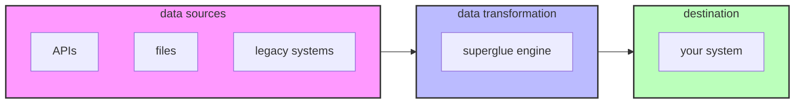

<p align="center">
  
</p>

> **Note:** This repository is a fork of [superglue](https://github.com/superglue-ai/superglue) that integrates OpenRouter support. Full credit goes to the original creators at [superglue-ai](https://github.com/superglue-ai) for their amazing work.

<h2 align="center">self-healing open source data connector 🍯</h2>

superglue is a self-healing open source data connector. You can deploy it as a proxy between you and any complex / legacy APIs and always get the data that you want in the format you expect.

Here's how it works: You define your desired data schema and provide basic instructions about an API endpoint (like "get all issues from jira"). Superglue then does the following:

- Automatically generates the API configuration by analyzing API docs.
- Handles pagination, authentication, and error retries.
- Transforms response data into the exact schema you want using JSONata expressions.
- Validates that all data coming through follows that schema, and fixes transformations when they break.


<div align="center">

[](https://github.com/superglue-ai/superglue/blob/main/LICENSE)
[](https://www.ycombinator.com/companies/superglue)
[](https://www.npmjs.com/package/@superglue/client)
[](https://hub.docker.com/r/superglueai/superglue)
[](https://twitter.com/adinagoerres)
[](https://twitter.com/sfaistenauer)
[](https://app.workweave.ai/reports/repository/org_0S2o9PLamHvNsTjHbszc38vC/914997268)


</div>

If you're spending a lot of time writing code connecting to weird APIs, fumbling with custom fields in foreign language ERPs, mapping JSONs, extracting data from compressed CSVs sitting on FTP servers, and making sure your integrations don't break when something unexpected comes through, superglue might be for you.



## quick start
### hosted version

1. Sign up for early access to the hosted version of superglue at [superglue.cloud](https://superglue.cloud)

2. Install the superglue js/ts client:
```bash
npm install @superglue/client
```

3. Configure your first api call:
```javascript
import { SuperglueClient } from "@superglue/client";

const superglue = new SuperglueClient({
  apiKey: "************"
});

const config = {
  urlHost: "https://futuramaapi.com",
  urlPath: "/graphql",
  instruction: "get all characters from the show",
  responseSchema: {
    type: "object",
    properties: {
      characters: {
        type: "array",  
        items: {
          type: "object",
          properties: {
            name: { type: "string" },
            species: { type: "string", description: "lowercased" }
          }
        }
      }
    }
  }
};

const result = await superglue.call({endpoint: config});
console.log(JSON.stringify(result.data, null, 2));

/*
output:
{
  "characters": [
    {
      "name": "Phillip J. Fry",
      "species": "human"
    },
    ...
  ]
}
*/
```

### self-hosted version

Run your own instance of superglue using Docker:

1. Pull the Docker image:
```bash
docker pull superglueai/superglue
```

2. Create a `.env` by copying the `.env.example` file at the root

3. Start the server:
```bash
docker run -d \
  --name superglue \
  --env-file .env \
  -p 3000:3000 \
  -p 3001:3001 \
  superglueai/superglue
```

4. Verify the installation:
```bash
curl http://localhost:3000/health
> OK

# or open http://localhost:3000/?token=your-auth-token
```

5. Open the dashboard to create your first configuration:
```bash
http://localhost:3001/
```

6. run your first call:
```bash
npm install @superglue/client
```

```javascript
import { SuperglueClient } from "@superglue/client";

const superglue = new SuperglueClient({
  endpoint: "http://localhost:3000",
  apiKey: "your-auth-token"
});

// either via config object
const config = {
  urlHost: "https://futuramaapi.com",
  urlPath: "/graphql",
  instruction: "get all characters from the show",
};

const result = await superglue.call({endpoint: config});

// or via the api id if you have already created the endpoint
const result2 = await superglue.call({id: "futurama-api"});

console.log(JSON.stringify(result.data, null, 2));
```


## key features

- **LLM-Powered Data Mapping**: Automatically generate data transformations using large language models
- **API Proxy**: Intercept and transform API responses in real-time with minimal added latency
- **File Processing**: Handle various file formats (CSV, JSON, XML) with automatic decompression
- **Schema Validation**: Ensure data compliance with your specified schemas
- **Flexible Authentication**: Support for various auth methods including header auth, api keys, oauth, and more
- **Smart Pagination**: Handle different pagination styles automatically
- **Caching & Retry Logic**: Built-in caching and configurable retry strategies

## 📖 Documentation

For detailed documentation, visit [docs.superglue.cloud](https://docs.superglue.cloud).

## 🤝 contributing
We love contributions! Feel free to open issues for bugs or feature requests.

[//]: # (To contribute to the docs, check out the /docs folder.)

## license

superglue is GPL licensed. The superglue client SDKs are MIT licensed. See [LICENSE](LICENSE) for details.

## 🙋‍♂️ support

- 💬 Discord: [Join our community](https://discord.gg/vUKnuhHtfW)
- 🐛 Issues: [GitHub Issues](https://github.com/superglue-ai/superglue/issues)

[](https://twitter.com/superglue_d)

## Using OpenRouter with Superglue

Superglue now supports using [OpenRouter](https://openrouter.ai/) as an alternative to OpenAI for all LLM operations. This allows you to access hundreds of AI models through a single unified API.

### Configuration

To use OpenRouter, add the following environment variables to your `.env` file:

```
# Set to true to use OpenRouter instead of OpenAI
USE_OPENROUTER=true

# Your OpenRouter API key (get one at https://openrouter.ai/keys)
OPENROUTER_API_KEY=sk-or-your-key-here

# OpenRouter base URL (usually you don't need to change this)
OPENROUTER_API_BASE_URL=https://openrouter.ai/api/v1

# OpenRouter model to use (e.g., 'anthropic/claude-3.5-sonnet', 'openai/gpt-4o', etc.)
OPENROUTER_MODEL=openai/gpt-4o

# OpenRouter model for schema generation (can be the same as OPENROUTER_MODEL or a faster model)
OPENROUTER_SCHEMA_MODEL=openai/gpt-4o
```

### Available Models

OpenRouter provides access to a wide range of models from various providers including OpenAI, Anthropic, Google, Mistral, and more. You can view the full list of available models on the [OpenRouter Models page](https://openrouter.ai/models).

Popular models include:

- `openai/gpt-4o` - OpenAI's GPT-4o
- `anthropic/claude-3.5-sonnet` - Anthropic's Claude 3.5 Sonnet
- `google/gemini-1.5-pro` - Google's Gemini 1.5 Pro
- `mistral/mixtral-8x7b` - Mistral's Mixtral 8x7B

### Benefits of Using OpenRouter

1. **Access to multiple models** - Use the best model for your specific use case
2. **Fallback routing** - Automatically retry with alternative models if your primary choice fails
3. **Cost management** - Compare pricing across providers
4. **Unified API** - No need to change your code to switch between models

### Switching Between OpenAI and OpenRouter

You can easily switch between OpenAI and OpenRouter by changing the `USE_OPENROUTER` environment variable:

- Set `USE_OPENROUTER=true` to use OpenRouter
- Set `USE_OPENROUTER=false` to use OpenAI directly

This allows you to switch providers without any code changes.
